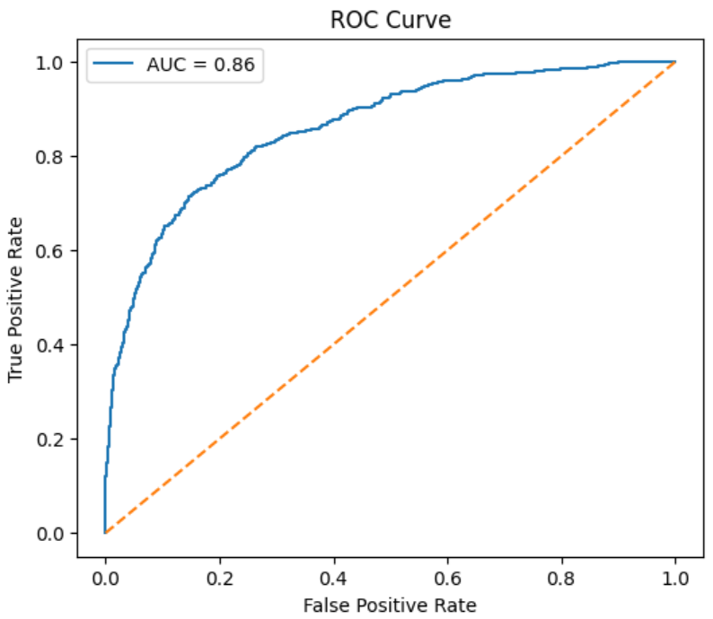
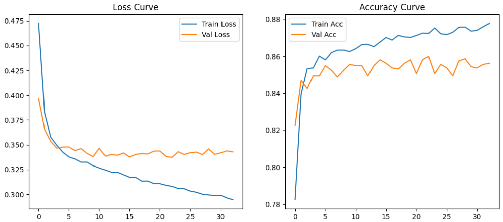

# Customer Churn Prediction using ANN

  
  
  

An end-to-end Deep Learning project to predict customer churn using an Artificial Neural Network (ANN). The project includes preprocessing, model training, evaluation, and deployment using Streamlit.

---

## Problem Statement

Predict whether a bank customer will churn (leave the bank) based on historical data.

---

## Dataset Overview

- Total Samples: 10,000  
- Features: 11  
- Target: Exited (0 = No Churn, 1 = Churn)

---

## Workflow

1. Data Cleaning  
2. Feature Engineering  
3. Encoding Categorical Features  
4. Feature Scaling  
5. ANN Model Training  
6. Model Evaluation  
7. Deployment  

---

## Preprocessing

- Dropped: RowNumber, CustomerId, Surname  
- Label Encoding: Gender  
- One-Hot Encoding: Geography  
- Standardization: Numerical features  

---

## Model Architecture

- Input Layer: 12 features  
- Hidden Layer 1: 64 neurons (ReLU)  
- Hidden Layer 2: 32 neurons (ReLU)  
- Output Layer: 1 neuron (Sigmoid)  

Loss: Binary Crossentropy  
Optimizer: Adam  

---

## Model Performance

Accuracy: 86%  
ROC-AUC Score: 0.86  

Classification Report:

    precision    recall  f1-score   support

    0       0.89      0.95      0.92      1607
    1       0.70      0.51      0.59       393

    accuracy                           0.86      2000
    macro avg       0.79      0.73      0.75
    weighted avg    0.85      0.86      0.85

---

## Visualizations

### ROC Curve

### Training Curves

---

## Project Structure

- streamlit_app/app.py  
- model/model.h5  
- artifacts/scaler.pkl  
- artifacts/label_encoder_gender.pkl  
- artifacts/onehot_encoder_geo.pkl  
- requirements.txt  
- Dockerfile  
- notebooks/  
  - customer-churn-prediction.ipynb  
  - prediction.ipynb  
- images/  
  - roc_curve.png  
  - training_curve.png  

---

## Deployment

Run locally:

    pip install -r requirements.txt  
    streamlit run streamlit_app/app.py  

---

## Key Learnings

- Handling categorical variables for ANN  
- Importance of scaling  
- Avoiding data leakage  
- Building end-to-end ML systems  
- Deployment using Streamlit  

---

## Future Improvements

- Hyperparameter tuning  
- Improve recall for churn class  
- Handle class imbalance  
- Docker and CI/CD deployment  

---